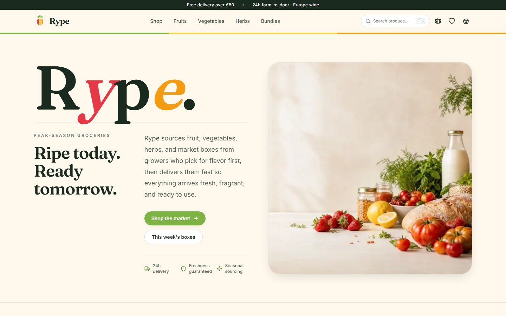
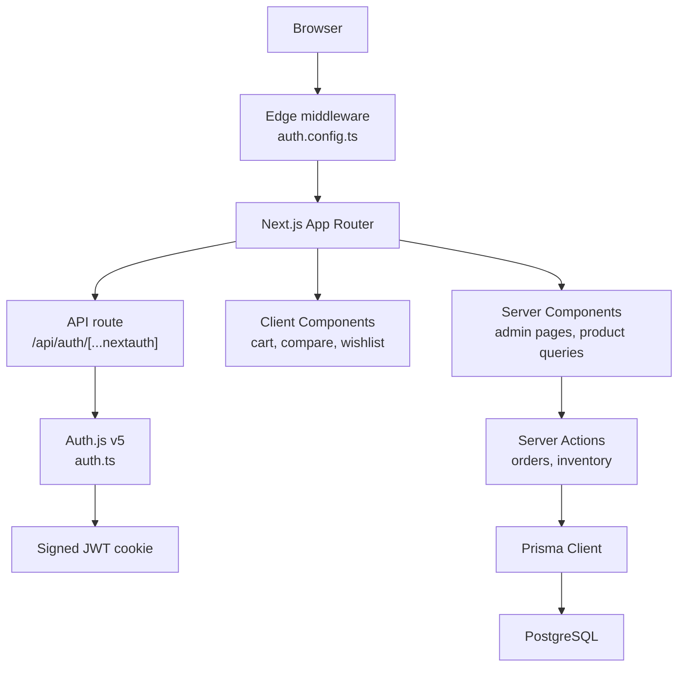

# Rype

> A polished grocery storefront for fresh European produce, paired with a role-aware admin panel for orders, inventory, and users.

[](https://nextjs.org/)
[](https://react.dev/)
[](https://www.typescriptlang.org/)
[](https://tailwindcss.com/)
[](https://vitest.dev/)
[](https://playwright.dev/)
[](https://authjs.dev/)
[](./LICENSE)

Rype is a full-stack ecommerce demo built to look and behave like a production-minded product rather than a static storefront mockup. It includes a public shopping experience, persistent cart state, checkout that creates real orders, stock updates, and an authenticated admin surface with role-aware access control.

## Live demo

[](https://rype-one.vercel.app)

- Live site: https://rype-one.vercel.app
- Admin sign-in: `/admin/login`

### Demo accounts

| Role | Email | Password | Access |
| --- | --- | --- | --- |
| `admin` | `admin@rype.local` | `admin123` | Full admin access |
| `staff` | `staff@rype.local` | `staff123` | Orders only |

## What it demonstrates

### Storefront

- Product catalog with filtering, sorting, and product detail pages
- Fuzzy search powered by Fuse.js
- Persistent cart drawer using Zustand + `localStorage`
- Wishlist and compare flows
- Multi-step checkout with validation
- Order creation backed by Prisma/Postgres
- Automatic stock decrement after checkout

### Admin

- Authenticated dashboard with KPIs and low-stock signals
- Orders table with status workflow, search, and accessible detail drawer
- Inventory management with inline stock/price/flag edits and reset actions
- Admin-only users page
- Role-aware navigation and route protection

### Engineering practices

- Edge-safe Auth.js middleware split from Node-only credential verification
- Server Actions for typed mutations close to their data layer
- Unit tests with Vitest and browser tests with Playwright
- GitHub Actions CI covering lint, typecheck, build, unit tests, and E2E
- Dependabot automation and repository hygiene files

## Tech stack

| Area | Tools |
| --- | --- |
| Frontend | Next.js 15 App Router, React 19, TypeScript, Tailwind CSS 4, Framer Motion, lucide-react |
| Forms and state | react-hook-form, Zod, Zustand |
| Auth | Auth.js v5, Credentials provider, optional Google OAuth, JWT sessions |
| Data | Prisma 6, PostgreSQL |
| Testing | Vitest, Playwright |
| Tooling | ESLint 9, PostCSS, GitHub Actions, Dependabot |

## Architecture



### Authentication design

Auth.js is split deliberately:

- `auth.config.ts` contains the edge-safe middleware configuration and role-aware route authorization.
- `auth.ts` adds Node-only credential verification with `bcryptjs`.

That separation keeps middleware deployable to the edge runtime while still supporting secure password verification on the server.

### Data model

The Prisma schema centers on four persisted models:

- `User`
- `Product`
- `Order`
- `OrderItem`

Money is stored in integer cents, order item names/prices are snapshotted at purchase time, and products carry stock plus merchandising flags such as `featured`, `organic`, and `inSeason`.

## Key product flows

### Checkout

1. Customer adds products to the cart.
2. Checkout validates address details with Zod.
3. A mock payment step simulates successful payment.
4. `placeOrderAction` creates the order and order items in Postgres.
5. `decrementStockAction` updates inventory.
6. The customer is redirected to a success page.

### Admin order handling

1. Authorized users sign in through Auth.js.
2. Middleware protects `/admin/*`.
3. Orders can be searched, filtered, and updated optimistically.
4. Admins can delete orders; staff cannot.
5. The order drawer includes focus management, Escape-to-close, and dialog semantics.

## Getting started

### Prerequisites

- Node.js 20+
- npm
- PostgreSQL database

### 1. Clone and install

```bash
git clone https://github.com/deepakpk-dev/rype.git
cd rype
npm install
```

### 2. Configure environment

```bash
copy .env.local.example .env.local
npx auth secret
```

On macOS or Linux, use `cp` instead of `copy`.

### 3. Provision the database

```bash
npm run db:push
npm run db:seed
```

### 4. Start the app

```bash
npm run dev
```

Open http://localhost:3000.

## Environment variables

| Variable | Required | Purpose |
| --- | --- | --- |
| `DATABASE_URL` | Yes | PostgreSQL connection string used by Prisma |
| `AUTH_SECRET` | Yes | Secret used to sign Auth.js JWT sessions |
| `AUTH_GOOGLE_ID` | No | Google OAuth client id |
| `AUTH_GOOGLE_SECRET` | No | Google OAuth client secret |
| `STRIPE_SECRET_KEY` | No | Reserved for future real Stripe checkout work |
| `NEXT_PUBLIC_STRIPE_PUBLISHABLE_KEY` | No | Reserved for future Stripe client integration |

## Database setup

The fastest path is a managed PostgreSQL provider such as Neon:

1. Create a database and copy the pooled connection string.
2. Add it to `.env.local` as `DATABASE_URL`.
3. Run `npm run db:push`.
4. Run `npm run db:seed`.
5. Optionally inspect data with `npm run db:studio`.

The seed script creates:

- 40 products
- one admin user
- one staff user
- three sample orders

If the database is unavailable, admin pages degrade with a visible warning while the public storefront remains browsable.

## Optional Google OAuth

1. Create OAuth credentials in Google Cloud Console.
2. Add `http://localhost:3000/api/auth/callback/google` as an authorized redirect URI.
3. Set `AUTH_GOOGLE_ID` and `AUTH_GOOGLE_SECRET`.
4. Add a matching user row to Postgres with the role you want.

## Scripts

| Command | Purpose |
| --- | --- |
| `npm run dev` | Start the development server |
| `npm run build` | Build the production bundle |
| `npm run start` | Start the production server |
| `npm run lint` | Run ESLint |
| `npm run typecheck` | Run TypeScript with `--noEmit` |
| `npm run test` | Run Vitest unit tests |
| `npm run test:watch` | Run Vitest in watch mode |
| `npm run test:coverage` | Generate test coverage |
| `npm run e2e` | Run Playwright E2E tests |
| `npm run e2e:ui` | Run Playwright UI mode |
| `npm run db:push` | Push the Prisma schema |
| `npm run db:migrate` | Create/apply a Prisma migration |
| `npm run db:seed` | Seed demo data |
| `npm run db:studio` | Open Prisma Studio |

## Testing and quality

Run the full local verification suite:

```bash
npm run lint
npm run typecheck
npm run build
npm run test
npm run e2e
```

Current automated coverage includes:

- cart, wishlist, compare, and cart total unit tests
- an admin E2E path covering sign-in, orders navigation, drawer focus, and Escape-to-close
- CI verification on every push and pull request to `main`

## Project structure

```text
.
|-- app/                         # App Router pages and route handlers
|   |-- admin/                   # Dashboard, orders, inventory, users, login
|   |-- api/auth/[...nextauth]/  # Auth.js route
|   |-- checkout/                # Checkout and success pages
|   |-- products/                # Catalog and PDP routes
|   |-- compare/                 # Compare page
|   `-- wishlist/                # Wishlist page
|-- components/
|   |-- admin/                   # Admin-only UI
|   |-- layout/                  # Header, footer, drawers, trays
|   |-- product/                 # Product cards and filters
|   `-- ui/                      # Shared UI primitives
|-- lib/
|   |-- orders/                  # Order actions and queries
|   |-- products/                # Product actions, queries, presentation
|   |-- stores.ts                # Zustand stores
|   `-- session-helpers.ts       # Role helpers
|-- prisma/                      # Schema and seed
|-- public/                      # Static media
|-- e2e/                         # Playwright specs
`-- __tests__/                   # Vitest specs
```

## Design and implementation decisions

- **Zustand for client state**: cart, wishlist, and compare are lightweight browser state, so Zustand keeps the implementation compact without Redux-style overhead.
- **JWT sessions**: middleware can authorize admin routes without database lookups on every request.
- **Server Actions**: mutations stay typed and colocated with server-side data access.
- **Integer cents for money**: avoids floating-point drift in persisted totals.
- **Read-only shared-db E2E**: the browser test exercises seeded data without mutating shared demo records.
- **Graceful DB degradation**: storefront use remains possible even when admin data fetches fail.

## Deployment

The app is designed for Vercel:

1. Import the repository into Vercel.
2. Configure the required environment variables.
3. Deploy.
4. Run `npm run db:push` and `npm run db:seed` locally against the production `DATABASE_URL`.

If Google OAuth is enabled in production, also add:

```text
https://<your-domain>/api/auth/callback/google
```

to the authorized redirect URIs in Google Cloud Console.

## Roadmap

| Status | Item |
| --- | --- |
| Done | Postgres + Prisma for users, products, orders, inventory |
| Done | Auth.js credentials flow and role-aware admin access |
| Done | Vitest, Playwright, CI, accessibility fixes |
| Todo | Real Stripe Checkout + webhook handling |
| Todo | Vercel Blob uploads for product imagery |
| Todo | Transactional email with Resend |
| Todo | Admin audit log |

## Contributing

See [CONTRIBUTING.md](./CONTRIBUTING.md).

## Security

See [SECURITY.md](./SECURITY.md).

## License

This project is licensed under the [MIT License](./LICENSE).
