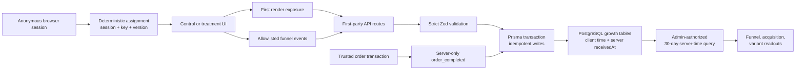
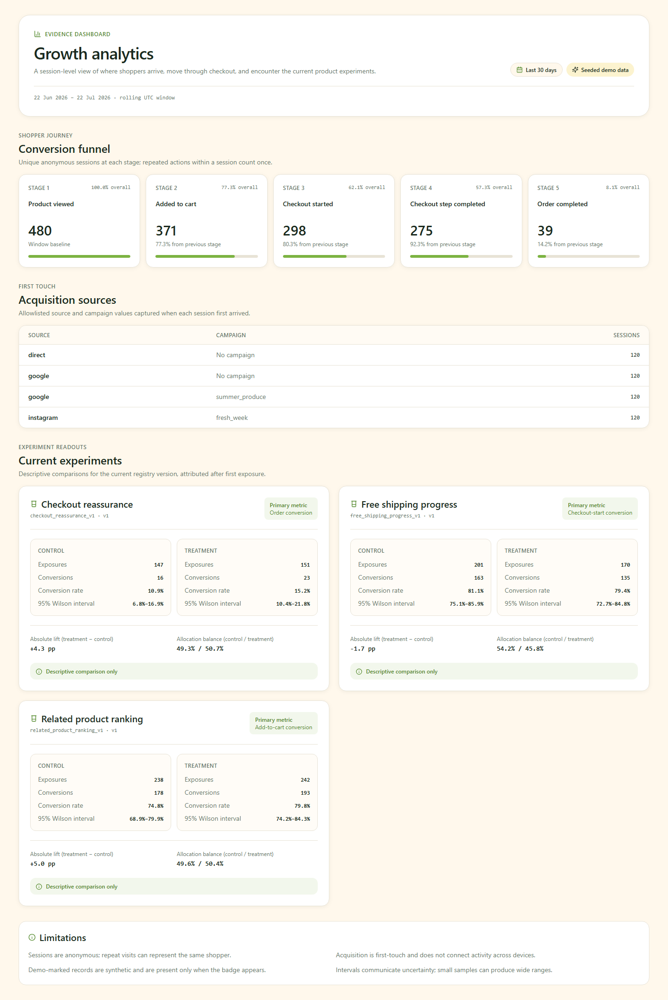
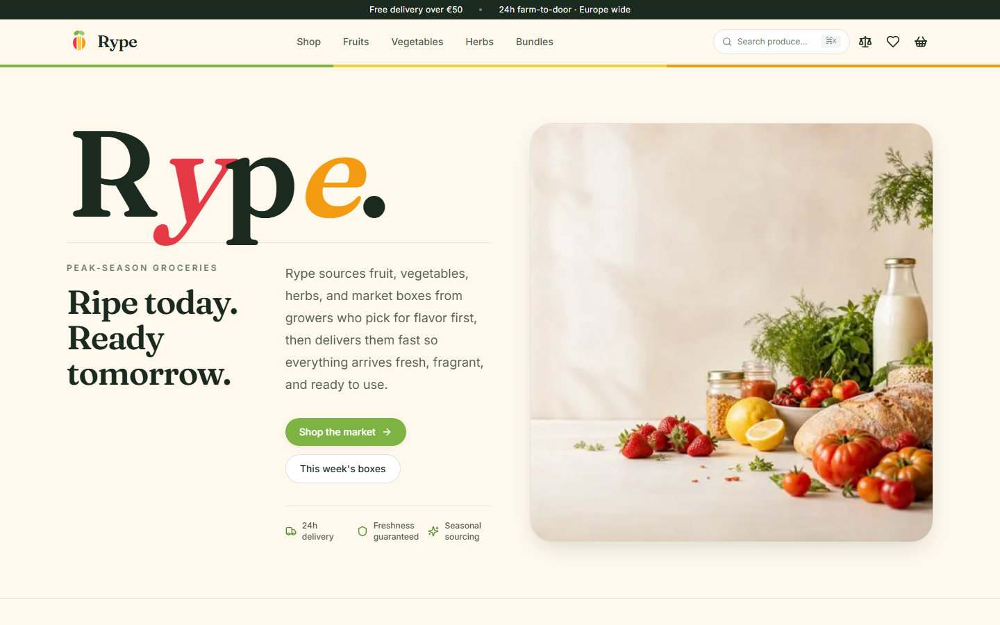

# Rype growth engineering case study

> A first-party experimentation and conversion analytics layer built into a full-stack grocery storefront.

[](https://nextjs.org/)
[](https://react.dev/)
[](https://www.typescriptlang.org/)
[](https://vitest.dev/)
[](https://playwright.dev/)
[](./LICENSE)

Rype started as a polished ecommerce demo: a public produce catalog, persistent cart, validated checkout, Prisma/Postgres order flow, and role-aware admin. This case study asks a harder product question: **how would a small commerce team learn where shoppers drop out and test improvements without shipping a third-party analytics platform or compromising customer privacy?**

The answer is a compact growth module with deterministic experiments, strict first-party event ingestion, trusted server-side order conversion, session-deduplicated reporting, and an admin-only evidence dashboard.

> [!IMPORTANT]
> **Every analytics result produced by `prisma/seed.ts` is synthetic demo data.** It is deliberately plausible but non-conclusive, is persisted with `demo: true`, and is visibly labeled `Seeded demo data` in the dashboard. These numbers are not customer outcomes, a causal result, or evidence that a treatment won.

## Business hypotheses

1. **Checkout reassurance** — benefit-led copy plus concise delivery and freshness reassurance may reduce uncertainty and improve completed-order conversion among exposed checkout sessions.
2. **Free-shipping progress** — progress toward the existing free-shipping threshold may increase checkout starts and useful basket building without changing prices or shipping rules.
3. **Related-product ranking** — ranking in-stock complementary products before generic related items may improve recommendation add-to-cart conversion without claiming personalization or machine learning.

Control variants preserve the current storefront and admin behavior. Treatments change presentation or ordering only; they do not alter stock, pricing, shipping policy, payment, or authorization.

## Experiment registry and primary metrics

| Experiment | Control | Treatment | Primary metric |
| --- | --- | --- | --- |
| `checkout_reassurance_v1` | Existing checkout presentation | Benefit-led checkout copy and reassurance panel | `order_completed` after first exposure |
| `free_shipping_progress_v1` | Existing cart totals | Progress/success message for the existing threshold | `checkout_started` after first exposure |
| `related_product_ranking_v1` | Existing related-product order | In-stock complementary categories first, with stable ties | Recommendation `add_to_cart` after first exposure |

Keys and allocation versions live in one registry. A redesign increments the version so new exposures do not contaminate an earlier readout.

## Event taxonomy

The public endpoint accepts four strictly shaped events. The fifth, the revenue conversion, can only be emitted by the trusted order flow.

| Event | When it is recorded | Allowlisted analytics properties |
| --- | --- | --- |
| `product_viewed` | Product detail view | product ID, category, price band, placement |
| `add_to_cart` | Successful cart mutation | product ID, quantity, unit price, resulting cart value/size, placement |
| `checkout_started` | Checkout renders with a non-empty cart | cart value and size |
| `checkout_step_completed` | A checkout step validates | step number/name and cart value |
| `order_completed` | Order transaction succeeds on the server | non-personal order ID, order total, item count, anonymous session ID |

Unknown event names, unknown fields, invalid identifiers, oversized requests, negative money, excessive quantities, and invalid experiment variants are rejected. Client-generated event IDs and database constraints make retries duplicate-safe. Public callers cannot submit `order_completed`.

## Architecture


```mermaid
flowchart LR
  A["Anonymous browser session"] --> B["Deterministic assignment<br/>session + key + version"]
  B --> C["Control or treatment UI"]
  C --> D["First render exposure"]
  C --> E["Allowlisted funnel events"]
  F["Trusted order transaction"] --> G["Server-only order_completed"]
  D --> H["First-party API routes"]
  E --> H
  H --> I["Strict Zod validation"]
  I --> J["Prisma transaction<br/>idempotent writes"]
  G --> J
  J --> K["PostgreSQL growth tables<br/>client time + server receivedAt"]
  K --> L["Admin-authorized<br/>30-day server-time query"]
  L --> M["Funnel, acquisition,<br/>variant readouts"]
```

The growth code follows the existing Next.js App Router architecture:

- `lib/growth/experiments.ts` owns the versioned registry and deterministic assignment.
- `lib/growth/provider.ts` creates an opaque first-party session and keeps assignments stable in browser storage.
- `app/api/growth/events` and `app/api/growth/exposures` validate bounded payloads before persistence.
- `lib/growth/persistence.ts` separates public events from trusted order conversion and fails open so analytics cannot block commerce.
- `lib/growth/analytics.ts` performs session deduplication, intention-to-treat conversion, lift, allocation, and Wilson intervals.
- `/admin/growth` is protected in middleware, navigation, and its server query.

## Assignment, exposure, and analysis methodology

Assignment hashes `sessionId + experimentKey + allocationVersion` into a stable 50/50 control or treatment bucket. The opaque session ID is random and is not derived from identity, device attributes, or a fingerprint. Browser persistence prevents switching variants during a session.

Assignment is not counted as exposure. An exposure is recorded only when the relevant experimental UI renders, with a unique database constraint on session, experiment, and version. Every public event and exposure stores a server-controlled `receivedAt`; client clocks are retained only when they fall within a five-minute skew bound and otherwise resolve to receipt time. Rolling windows and post-exposure conversion ordering use `receivedAt`, so a stale or future browser clock cannot move rows into a reporting window or manufacture conversion order. Trusted `order_completed` rows use one server timestamp for both fields.

The dashboard uses a single rolling 30-day UTC window. Funnel stages count a session once even if an action repeats. Acquisition is first-touch. Variant cards report exposures, conversions, conversion rate, absolute percentage-point lift, allocation balance, and a descriptive 95% Wilson interval. Fewer than 100 exposures in either variant is labeled `Insufficient evidence`; larger demo samples remain `Descriptive comparison only`. The code never selects a winner or reallocates traffic.

## Privacy and data minimization

This table applies to the analytics layer. The separate fictional commerce order model still contains the delivery fields needed to demonstrate checkout and fulfillment.

| Data | Analytics treatment | Reason |
| --- | --- | --- |
| Opaque session ID | Stored | Session-level deduplication without identity |
| `utm_source`, `utm_medium`, `utm_campaign` | Allowlisted and bounded | Coarse first-touch acquisition reporting |
| Landing path and referrer category | Allowlisted/coarsened | Useful entry context without raw URLs |
| Product/order IDs and integer-cent values | Stored only for typed events | Funnel and commerce diagnostics |
| Client event time | Bounded to five minutes around server receipt | Diagnostics without trusting browser clocks for reporting |
| Server `receivedAt` | Stored and used for windows/ordering | Stable chronology for attribution and dashboard queries |
| Name, email, phone, delivery address | **Never stored or transported** | Not needed for the stated analytics purpose |
| IP address, user-agent, device fingerprint | **Never stored or transported** | No fingerprinting or unnecessary device data |
| Raw referrer URL, arbitrary query strings/metadata | **Never stored** | Avoid accidental secrets, PII, and unbounded payloads |

## Deterministic demo data

`npm run db:seed` preserves the existing products/users behavior, recreates the three sample commerce orders, and transactionally replaces only growth rows marked `demo: true`. It refuses replacement if a demo session owns any non-demo analytics, preventing cascade deletion of real records.

The pure `buildGrowthDemoRows()` builder uses the fixed anchor `2026-07-19T00:00:00.000Z`, stable IDs, and fixed offsets. It creates 480 anonymous sessions across:

- direct traffic;
- Google paid search (`cpc`);
- Google organic search;
- Instagram paid social.

Every experiment receives at least 240 exposed sessions and at least 100 sessions per variant. The funnel and variant differences are generated, small, and intentionally inconclusive. Running the seed twice produces the same growth row IDs and totals.

The schema includes timestamp-leading indexes for event time, exposure time, server receipt time, and session first-seen time. `npm run db:push` is appropriate for this local demo; an existing production database requires a reviewed Prisma migration that adds/backfills `receivedAt` and creates these indexes using the deployment strategy appropriate for its traffic and PostgreSQL version.

## Run the case study locally

### Prerequisites

- Node.js 20+
- npm
- a PostgreSQL database reachable through `DATABASE_URL`

### Setup

```bash
git clone https://github.com/deepakpk-dev/rype.git
cd rype
npm install
copy .env.local.example .env.local
npx auth secret
npm run db:push
npm run db:seed
npm run dev
```

On macOS or Linux, use `cp` instead of `copy`. Put the generated auth secret in `.env.local`, then open [http://localhost:3000](http://localhost:3000).

### Admin dashboard

Sign in at `/admin/login` with the local seeded account:

| Role | Email | Password | Access |
| --- | --- | --- | --- |
| `admin` | `admin@rype.local` | `admin123` | Full admin, including Growth |
| `staff` | `staff@rype.local` | `staff123` | Orders only; Growth is denied |

Open `/admin/growth`. A correctly seeded view shows the `Seeded demo data` badge, five funnel stages, four acquisition groupings, and three experiment cards.

### Dashboard screenshot



This portfolio asset renders the actual `GrowthDashboard` component from deterministic `buildGrowthDemoRows()` output transformed by the production analytics functions. The visible figures are synthetic aggregates; the image contains no credentials or customer identity. The temporary local-only capture harness was removed after capture.

To refresh the asset from the authenticated, database-backed dashboard locally:

1. Configure a loopback/local PostgreSQL `DATABASE_URL` and `AUTH_SECRET` in `.env.local`.
2. Confirm the fixed demo anchor still falls inside the dashboard's rolling 30-day window. If it has aged out, choose a new explicit fixed anchor and update the seed test before seeding; do not switch to a moving clock.
3. Run `npm run db:push && npm run db:seed && npm run build`.
4. Run `npm run start`, sign in as the seeded admin, and open `/admin/growth` at a desktop viewport.
5. Confirm the page visibly includes `Seeded demo data` and contains no credentials or customer identity.
6. Replace `public/readme-growth-dashboard.png` with a full-page capture.

## Existing commerce product

The growth layer sits inside a functioning ecommerce demo rather than a standalone chart mockup.

### Storefront

- catalog filtering, sorting, fuzzy search, and product detail pages;
- persistent Zustand cart, wishlist, and comparison flows;
- validated multi-step checkout and server-side order creation;
- Prisma-backed products, stock updates, and integer-cent money.

[](https://rype-one.vercel.app)

The linked deployment is the storefront preview; run this branch locally for the seeded growth dashboard.

### Admin

- authenticated KPIs and low-stock signals;
- order search, status workflow, and accessible detail drawer;
- inventory management and admin-only user management;
- role-aware middleware, navigation, and server authorization;
- admin-only growth analytics with database-unavailable and empty states.

## Environment variables

| Variable | Required | Purpose |
| --- | --- | --- |
| `DATABASE_URL` | Yes | PostgreSQL connection used by Prisma |
| `AUTH_SECRET` | Yes | Signs Auth.js JWT sessions |
| `AUTH_GOOGLE_ID` / `AUTH_GOOGLE_SECRET` | No | Optional Google OAuth |
| `STRIPE_SECRET_KEY` / `NEXT_PUBLIC_STRIPE_PUBLISHABLE_KEY` | No | Reserved for future real Stripe checkout |

If the database is unavailable, public storefront browsing remains usable and admin data pages show a bounded error state.

## Verification

```bash
npm run lint
npm run typecheck
npm run test
npm run build
npm run e2e
```

Vitest covers deterministic assignment and demo generation, strict schemas, duplicate-safe persistence, trusted conversion, storefront instrumentation, ranking, funnel math, experiment uncertainty, queries, and permissions. Playwright covers the storefront experiment surfaces and the authenticated growth dashboard when a seeded database is available. CI runs lint, type checking, build, unit tests, and browser tests; no stale numeric test-count badge is maintained.

## Project map

```text
app/
|-- admin/growth/                # Authorized evidence dashboard
|-- api/growth/                  # Public event and exposure ingestion
|-- checkout/                    # Experimented checkout and trusted order flow
`-- products/                    # Catalog, PDP, and related ranking
components/growth/               # Exposure boundary
lib/growth/                      # Registry, provider, schemas, persistence, analytics
prisma/                          # Growth models and deterministic seed
__tests__/growth/                # Growth unit and integration-style tests
e2e/                             # Storefront and admin browser flows
```

## Limitations

- Sessions are anonymous, so repeat visits can represent the same shopper and cross-device activity is not joined.
- Attribution is first-touch and intentionally coarse; it is not multi-touch incrementality analysis.
- The 30-day window is operational reporting, not a substitute for a pre-registered experiment duration.
- The fixed July 2026 demo anchor eventually ages out of that rolling window; a future portfolio capture must deliberately version a new fixed anchor and its test.
- Demo outcomes are deterministic synthetic examples with no statistical or causal validity.
- Wilson intervals communicate uncertainty but do not correct for repeated peeking, multiple comparisons, novelty, or seasonality.
- Bot, employee, QA, and internal traffic are not filtered in this portfolio implementation.
- Event delivery is best-effort and first-party; there is no warehouse reconciliation or formal data-quality SLA.
- This branch includes the target Prisma schema but no generated production migration; rollout requires a reviewed migration and index-build plan.
- There is no consent manager, identity stitching, experiment lifecycle console, automated rollout, or winner selection.

## Production rollout requirements

Before exposing real traffic or interpreting customer behavior, a production owner would need to:

- complete legal/privacy review and connect collection to consent requirements by market;
- define retention, deletion, data-subject request, access-control, and audit policies;
- filter bots, uptime monitors, employees, QA, duplicate tabs, and other internal traffic;
- document anonymous identity lifetime and explicit cross-device/identity-stitching rules;
- add event-volume, schema-rejection, allocation, missing-conversion, and ingestion-latency monitoring;
- export or reconcile events to an analytics warehouse with versioned contracts and quality checks;
- deploy a reviewed Prisma migration that backfills `receivedAt`, builds the time indexes safely, and verifies query plans before enabling reporting traffic;
- run baseline sizing and power analysis before launch;
- pre-register the hypothesis, primary/guardrail metrics, eligible population, duration, and stopping rules;
- add experiment draft/review/start/stop/archive lifecycle controls and mutual-exclusion rules;
- define rollback criteria, feature-flag ownership, on-call responsibility, and stakeholder sign-off;
- validate accessibility, performance, SEO, browser compatibility, and commerce guardrails for every treatment;
- use staged rollout and holdouts where appropriate, then document the decision regardless of result.

## Security, contributing, and license

See [SECURITY.md](./SECURITY.md), [CONTRIBUTING.md](./CONTRIBUTING.md), and [LICENSE](./LICENSE).
